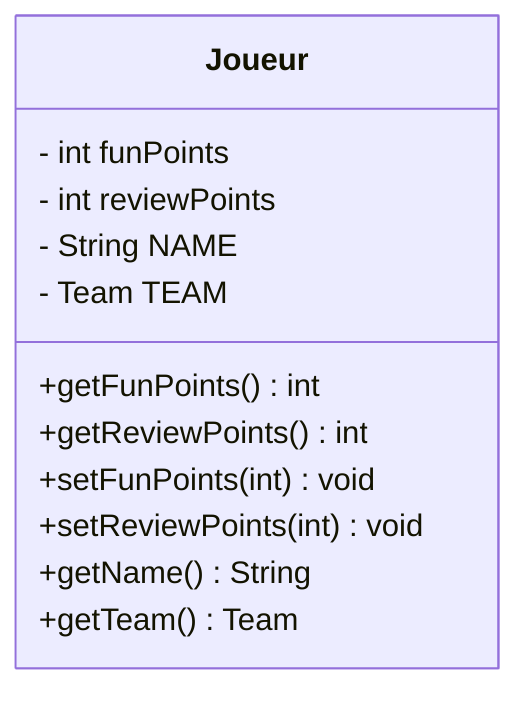

```mermaid
classDiagram
class Joueur {
    - int funPoints
    - int reviewPoints
    - String NAME
    - Team TEAM
    +getFunPoints() int
    +getReviewPoints() int
    +setFunPoints(int) void
    +setReviewPoints(int) void
    +getName() String
    +getTeam() Team
    }
```